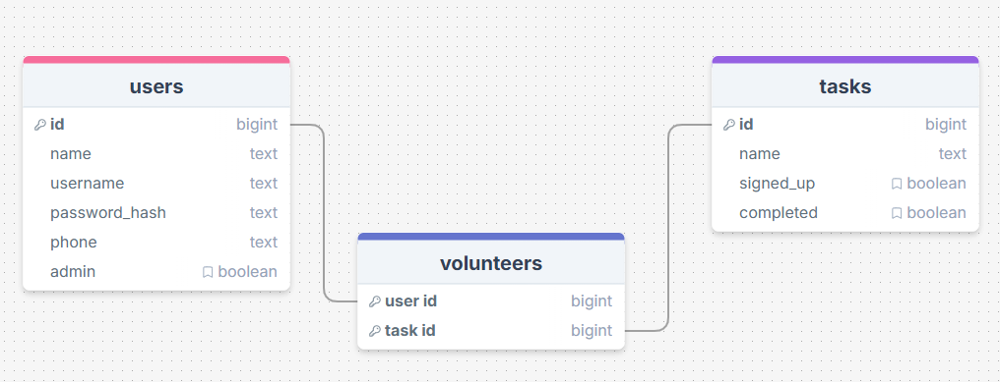

# Sprint 1 - A Working UI Prototype

## Sprint Goals

Develop a prototype that simulates the key functionality of the system, then test and refine it so that it can serve as the model for the next phase of development in Sprint 2.

[Figma](https://www.figma.com/) is used to develop the prototype.

---

## Initial Database Design

Replace this text with notes regarding the DB design.
This is my initial database design linking the users and tasks to make a volunteer. Each user and task will have multiple bits of data attached. The tasks include a signed_up and completed field for the user and admin to track each task.

### Required Data Input

The end-user will input information about themselves when they are signing up. The admin will be inputting information about the tasks when they want a new one created.

This information will be filled out using a form and submitted to the database

The user can mark a task as signed up or completed (used for personal tracking) and will update the data in the database

### Required Data Output

The system will display output data by showing the list of tasks on the home screen, showing a list of tasks along with who has signed up for it on the admin homescreen, the details of each task, the signed up and completed check box next to each task.

### Required Data Processing

Replace this text with a description of how the data will be processed to achieve the desired output(s) - any processes / formulae?

---

## UI 'Flow'

The first stage of prototyping was to explore how the UI might 'flow' between states, based on the required functionality.

This Figma demo shows the initial design for the UI 'flow':

<iframe style="border: 1px solid rgba(0, 0, 0, 0.1);" width="400" height="700" src="https://embed.figma.com/proto/5ZJNorMpFXxIvVf18IP8X5/300-DTD-Gymnastics-Flow?node-id=1-5&p=f&scaling=scale-down&content-scaling=fixed&page-id=0%3A1&starting-point-node-id=1%3A5&embed-host=share" allowfullscreen></iframe>

### Testing

My client said "It would be easier for the admin to contact each person to remind them about a task they have signed up for and havn't done it yet when it's close to the deadline. It could be a good idea to add an admin user list. When the admin clicks on a users name underneath the task it will take them to a page will their contact details and a list of all of the tasks they have volunteered for."

### Changes / Improvements

I listened to my client and added a new page when the admin clicks on a users name. This will show the clients contact details e.g. email and phonenumber, as well as showing what tasks the user has volunteered for.
I also realised that there was no way for the user to signup, so i added a sign up button on the sign in page taking the user to the sign up page.

<iframe style="border: 1px solid rgba(0, 0, 0, 0.1);" width="400" height="700" src="https://embed.figma.com/proto/KXKjpTe2NPsoiKvnJFjezL/300-DTD-Gymnastics-Flow-v2?node-id=1-5&p=f&scaling=scale-down&content-scaling=fixed&page-id=0%3A1&starting-point-node-id=1%3A5&embed-host=share" allowfullscreen></iframe>

---

## Initial UI Prototype

The next stage of prototyping was to develop the layout for each screen of the UI.

This Figma demo shows the initial layout design for the UI:

<iframe style="border: 1px solid rgba(0, 0, 0, 0.1);" width="400" height="700" src="https://embed.figma.com/proto/JkAPEwX7dMzrxb4eipqN9Y/300-DTD-Gymnastics-Initial-Prototype?node-id=1-5&p=f&scaling=scale-down&content-scaling=fixed&page-id=0%3A1&starting-point-node-id=1%3A5&embed-host=share" allowfullscreen></iframe>

### Testing

I shows this to my client and they said "The website looks nice and is easy to navigate. However it would be better you got rid of the log in and sign up on the top right of the log in and sign up page. it would be easier for the user if there was message underneath saying something like "Don't have an account? login" and maybe underline it to show the user that they can click on it to take them to the login or signup page."

### Changes / Improvements

I have listened to my client and added the text below the login/signup form, so that the user can easily see it and change between the pages.

<iframe style="border: 1px solid rgba(0, 0, 0, 0.1);" width="400" height="700" src="https://embed.figma.com/proto/WHKiiZkEyR07JJnRP5JPNb/300-DTD-Gymnastics-Initial-Prototype-v2?node-id=1-5&p=f&scaling=scale-down&content-scaling=fixed&page-id=0%3A1&starting-point-node-id=1%3A5&embed-host=share" allowfullscreen></iframe>

### Testing

I showed this to my client and they said "Its really good but for some reason last time i didn't notice that there as no home button. It would be good for users to go straight to the home screen from any page, as well as showing the title of the website on each page."

### Changes / Improvements

I listened to my client and combined their ideas. I made it so that when the user clicks on the website name (Gymnastics Nelson) it takes them to the home page.

<iframe style="border: 1px solid rgba(0, 0, 0, 0.1);" width="400" height="700" src="https://embed.figma.com/proto/WXdJN77YWno5VsyU6E1SNN/300-DTD-Gymnastics-Initial-Prototype-v3?node-id=1-5&p=f&scaling=scale-down&content-scaling=fixed&page-id=0%3A1&starting-point-node-id=1%3A5&embed-host=share" allowfullscreen></iframe>

### Testing

Replace this text with notes about what you did to test the UI flow and the outcome of the testing.

### Changes / Improvements

Replace this text with notes any improvements you made as a result of the testing.

*FIGMA IMPROVED INITIAL PROTOTYPE - PLACE THE FIGMA EMBED CODE HERE - MAKE SURE IT IS SET SO THAT EVERYONE CAN ACCESS IT*

---

## Refined UI Prototype

Having established the layout of the UI screens, the prototype was refined visually, in terms of colour, fonts, etc.

This Figma demo shows the UI with refinements applied:

<iframe style="border: 1px solid rgba(0, 0, 0, 0.1);" width="400" height="700" src="https://embed.figma.com/proto/MVerI3uw48AwhU8lJ1DX8I/300-DTD-Gymnastics-Refined-Prototype?node-id=1-5&p=f&scaling=scale-down&content-scaling=fixed&page-id=0%3A1&starting-point-node-id=1%3A5&embed-host=share" allowfullscreen></iframe>

### Testing

I showed this design to my client and they said that it looks great but the colours looked a bit dull

### Changes / Improvements

I changed the colour scheme to brighter shade of blue and my client said that looked a lot better

<iframe style="border: 1px solid rgba(0, 0, 0, 0.1);" width="400" height="700" src="https://embed.figma.com/proto/JiEb6ZDCriI9iOwxlibURm/300-DTD-Gymnastics-Refined-Prototype-v2?scaling=scale-down&content-scaling=fixed&page-id=0%3A1&node-id=1-5&starting-point-node-id=1%3A5&embed-host=share" allowfullscreen></iframe>

---

## Sprint Review

THis sprint allowed me to make a working prototype of the website so i could test it with my client without coding the whole thing. I kept improving the design based on the clients feedback which led me to the final product, now the prototype is ready to be turned into a website in sprint 2.

