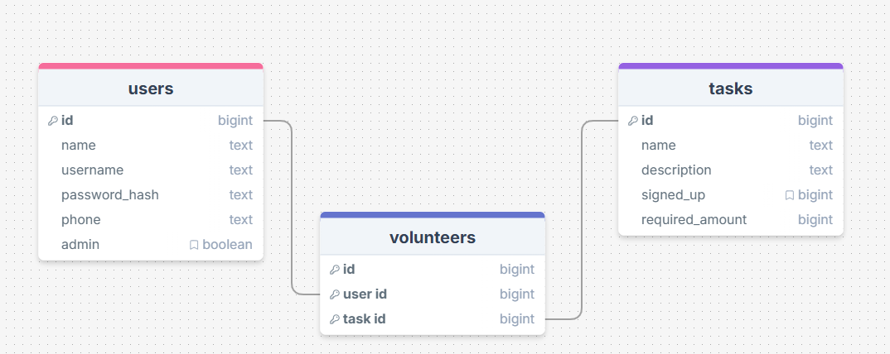
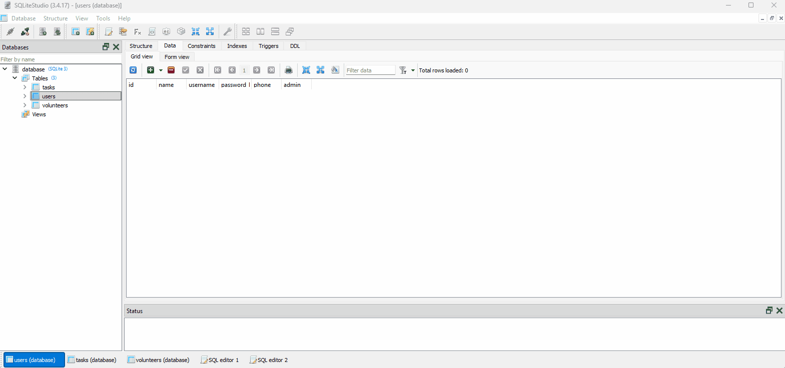
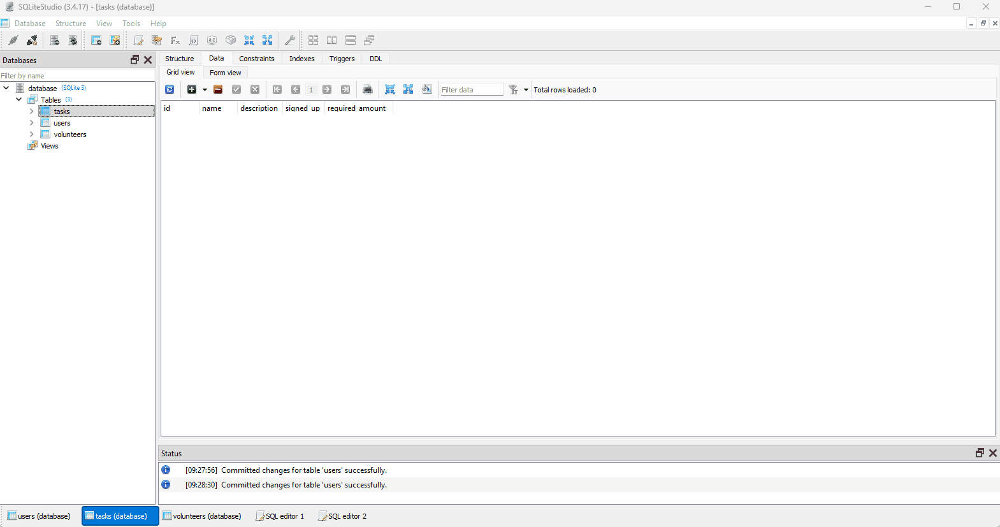
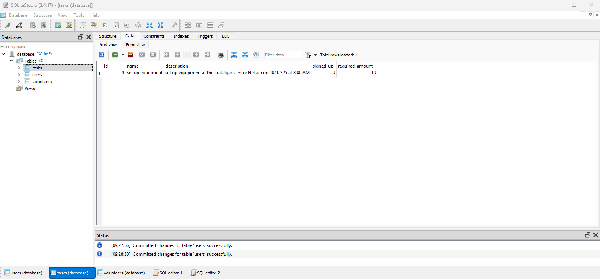
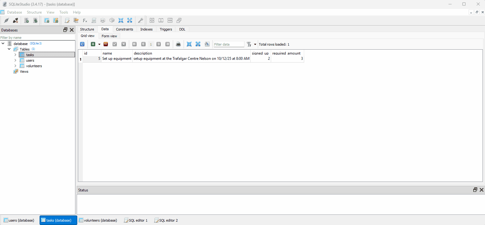

# Sprint 2 - A Minimum Viable Product (MVP)

## Sprint Goals

Develop a bare-bones, working web application that provides the key functionality of the system, then test and refine it so that it can serve as the basis for the final phase of development in Sprint 3.

---

## Implemented Database Schema

This is my updated database schema

---
## Client

My client said that when they looked at the personal checklist the two tick boxes might be confusing so they suggest that i only make one tick box for if they are volunteering or not.

## Testing Register

I am testing what happens whan a user registers for the website. It went well as teh user was added to the database.

### Changes / Improvements

Replace this text with notes any improvements you made as a result of the testing.

---

## Testing Add Task

I am testing the add task button. The task was added.

---

## Testing Delete Task

I am testing what happens when a task is deleted. The task was deleted from the database and all of the volunteers of that task as well.

---

## Testing Volunteer/Un volunteer

I am testing what happens when a user volunteers and un volunteers for a task. When volunteering, a new item is created in the volunteer table in the database and the signed up value in the task table is increased by one. When the user un volunteers the signed up value in the tasks table decreases by one and the volunteer item in the volunteers table is deleted.

---

## Testing Volunteer/un volunteer when the signed up amount reaches the required amount

I am testing what happens when a user signs up for a taskl that is about to reach the required amount. The task dissapears from the home page but is still in their personal list and in the database the signed up amount increases and a new volunteer is made. When the user un volunteers from the task it reappears on the home page and the signed up amount decreases by one and the volunteer is deleted.

## Feedback from client

After testing all of teh features to make sure they work correctly I showed the website to my client where they said that the website functions great and works how they expected it to.

---

## Sprint Review

This sprint moved the project forward by turning it into a functional website. The main features such as registering a user, adding and deleting tasks and there were some small bugs but were fixed easily. Now the website is ready for a final polish in sprint 3.

