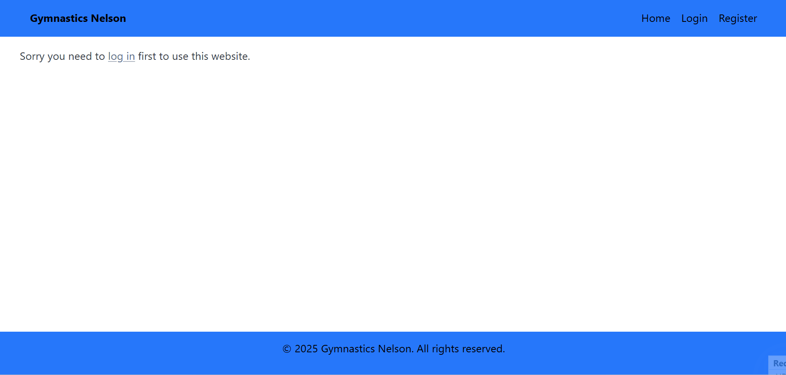

# Sprint 3 - A Refined and Complete System

## Sprint Goals

Develop the system until it is fully featured, with a refined UI and it satisfies the requirements. The system will be fully tested at this point.

---

## Updated Database Schema (if it changed)

My databse hasn't changed

---

## Final Implementation

The web app is fully implemented with a refined UI:

---

## Feedback from client

I showed the final website to my client and they said it looks perfect, the design is exactly how they wanted it to look. I also showed them the list of UX principles i have chosen and they said that the website follows them

---

## Sprint Review

This sprint moved the project forward by allowing me to fully complete my website by implementing all of the UI. Now the project is complete and my client is satisfied.

